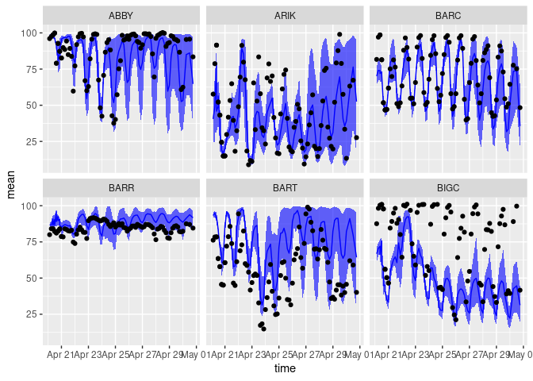

``` r
library(neonstore)
library(score4cast)
library(arrow)
library(dplyr)
library(ggplot2)
```

Establish a connection to EFI NOAA GEFS archive:

``` r
Sys.unsetenv("AWS_DEFAULT_REGION")
Sys.unsetenv("AWS_S3_ENDPOINT")
Sys.setenv(AWS_EC2_METADATA_DISABLED="TRUE")

s3 <- arrow::s3_bucket("drivers/noaa/neon/gefs", 
                       endpoint_override =  "js2.jetstream-cloud.org:8001",
                       anonymous=TRUE)
df <- arrow::open_dataset(s3)
```

Let’s collect forecasts made on a specific date because it’s still huge:
(1.55 GB, but operation consumes \~ 7 GB)

``` r
fc <- df |> 
  filter(start_time >= as.Date("2022-04-20"),
         variable == "RH") |> 
  collect()
```

Now let’s score the forecast. First, we need to pre-process NEON data a
bit into the correct format.

NEON doesn’t measure at 2m height. I average over horizontal and
vertical positions – all horizontal positions are at the same site so it
makes sense to use the average. We could use the max vertical sensor,
but heights vary and we’d have fewer observations that way. We could
subset these measurements to just the 3 or 6 hr interval used by NOAA
rather than every 30 minutes, but as the intervals mesh, we can just let
the `inner_join` inside of `crps_logs_score` take care of that.

``` r
rh <- neon_table(table = "RH_30min", lazy=TRUE) # Humidity, note two different sensor positions
target <- rh |> 
  filter(startDateTime >= as.Date("2022-04-20")) |>
  select(startDateTime, siteID, RHMean, horizontalPosition, verticalPosition) |>
  group_by(siteID, startDateTime) |> 
  summarise(observed = mean(RHMean)) |>
  mutate(variable = "RH") |>
  rename(site_id = siteID, time = startDateTime) |> 
  arrange(site_id,time) |> 
  collect()
```

    `summarise()` has grouped output by "siteID". You can override using the
    `.groups` argument.

    Warning: Missing values are always removed in SQL aggregation functions.
    Use `na.rm = TRUE` to silence this warning
    This warning is displayed once every 8 hours.

We are now ready to compute the scores:

``` r
scores <- score4cast::crps_logs_score(fc, target)
```

    Joining, by = c("site_id", "variable", "time")

``` r
scores |> filter(!is.na(crps))
```

    # A tibble: 6,487 × 13
       site_id time                variable  mean    sd observed   crps   logs
       <chr>   <dttm>              <chr>    <dbl> <dbl>    <dbl>  <dbl>  <dbl>
     1 ABBY    2022-04-20 03:00:00 RH        98.6 0.244     96.0  2.43  145.  
     2 ABBY    2022-04-20 09:00:00 RH        97.6 0.268     98.7  0.972   8.10
     3 ABBY    2022-04-20 15:00:00 RH        91.2 0.705     79.0 11.8   Inf   
     4 ABBY    2022-04-20 21:00:00 RH        86.6 4.95      87.3  1.26    2.71
     5 ABBY    2022-04-20 06:00:00 RH        98.4 0.446     97.4  0.754   2.24
     6 ABBY    2022-04-20 12:00:00 RH        96.4 0.367     99.9  3.28  100.  
     7 ABBY    2022-04-20 18:00:00 RH        83.7 4.92      92.7  6.27    3.82
     8 ABBY    2022-04-21 00:00:00 RH        94.2 2.06      82.6 10.5    26.3 
     9 ABBY    2022-04-20 09:00:00 RH        97.0 0.747     98.7  1.26    2.94
    10 ABBY    2022-04-20 12:00:00 RH        96.2 0.845     99.9  3.26   16.4 
    # … with 6,477 more rows, and 5 more variables: quantile02.5 <dbl>,
    #   quantile10 <dbl>, quantile90 <dbl>, quantile97.5 <dbl>, start_time <dttm>

``` r
sites <- scores |> select(site_id) |> distinct() |> head() |> pull(site_id)

scores |> filter(site_id %in% sites, time < lubridate::as_datetime("2022-05-01")) |>
  ggplot(aes(time)) + 
  geom_ribbon(aes(y=mean, ymin=quantile02.5, ymax = quantile97.5), alpha=0.6, fill="blue") +
  geom_line(aes(y=mean), col="blue") +
  geom_point(aes(y = observed)) + facet_wrap(~site_id)
```

    Warning: Removed 3 rows containing missing values (geom_point).


